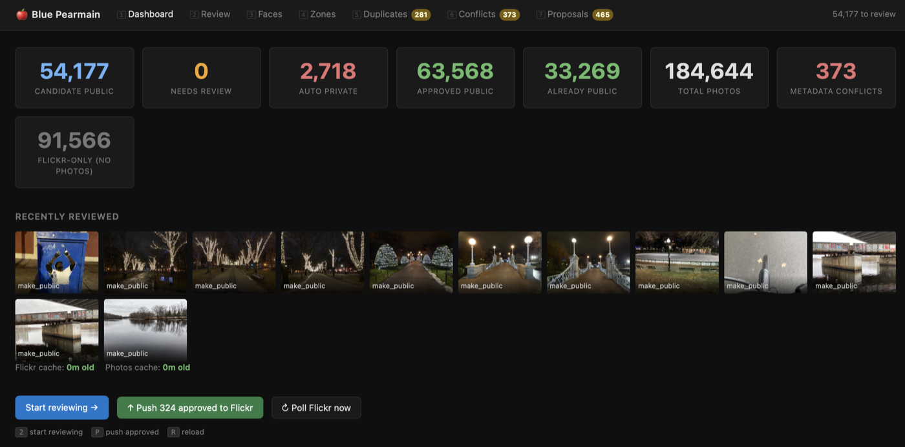
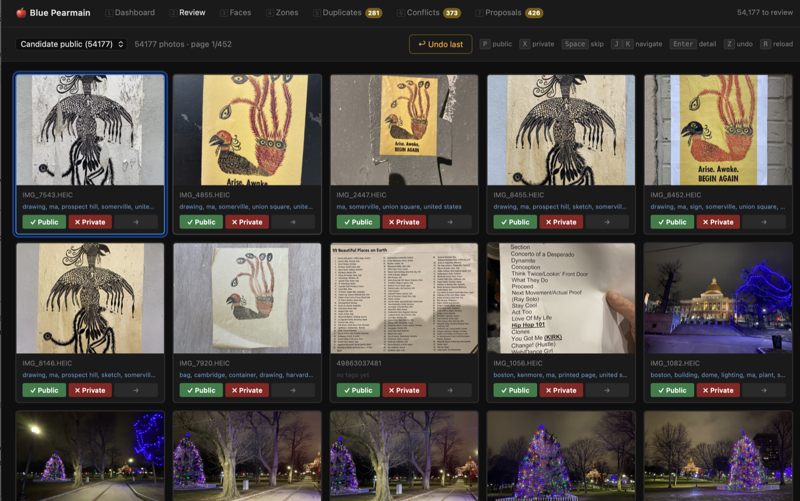
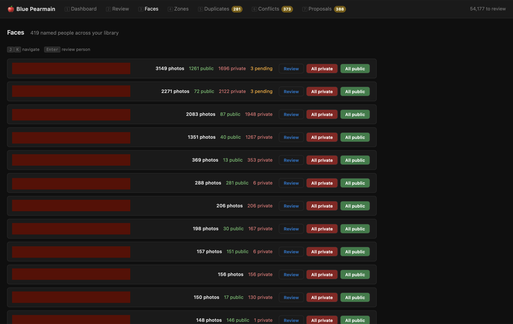
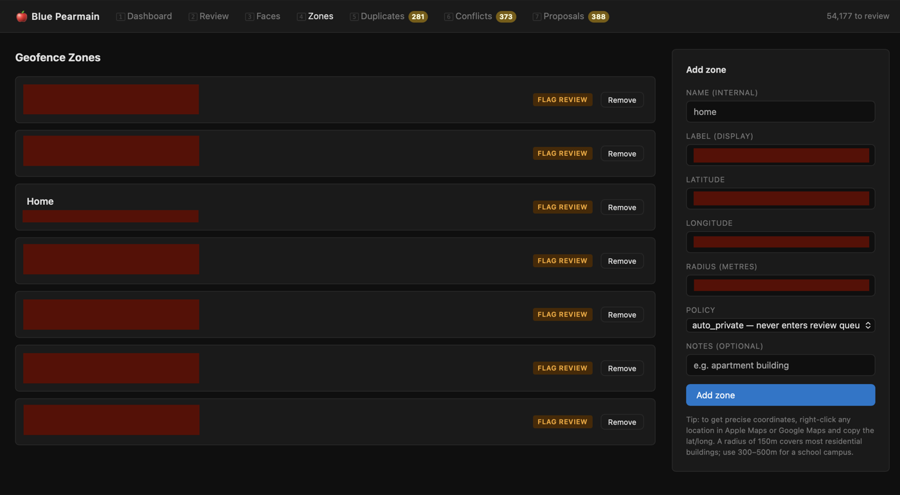
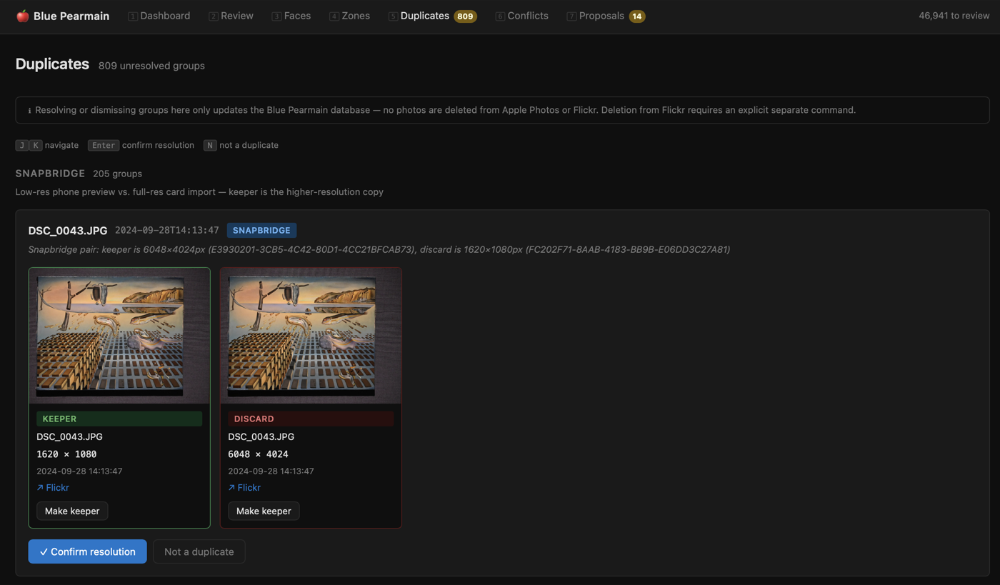
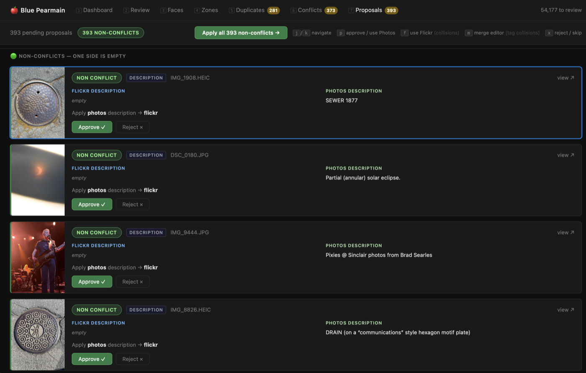

# Blue Pearmain

A bidirectional sync and curation tool for photo libraries that span both Apple Photos and Flickr. It keeps metadata (titles, descriptions, tags) in sync between the two, automates privacy triage using Apple's ML analysis and geofencing, and serves a local web UI for reviewing photos, resolving metadata conflicts, and managing duplicates and albums.

The motivation behind this project — archival stewardship, provenance, and what it means to preserve photos with their context intact — is written up in [Filing Vivian Maier](https://cdevers.github.io/2026/05/12/Filing-Vivian-Maier.html).

---

## The problem

**Review backlog.** Flickr's iOS app syncs your entire camera roll automatically — convenient for backup, but it means a large accumulation of private photos that you never chose to share. Manually reviewing tens of thousands of photos to decide what to make public, what to tag, and what to keep private is impractical. Auto-upload from multiple devices (iPhone and iPad) also produces duplicates, and Nikon's Snapbridge feature compounds this by uploading a low-resolution preview immediately and the full-resolution original later — resulting in two Flickr IDs for the same shot.

**Metadata drift.** Flickr and Apple Photos are independent libraries with no built-in sync. After editing titles, descriptions, or tags in one but not the other over months or years, the two sides diverge silently. Getting them back in agreement — and keeping them that way — requires a tool that can diff the two caches, auto-apply clear cases, and surface genuine conflicts for human judgment.

Blue Pearmain addresses both:

- Polls Flickr for newly uploaded photos and cross-references them against your Apple Photos library
- Harvests Apple's AI analysis (scene labels, face detection, GPS) to drive automatic privacy classification
- Applies geofence rules to keep photos from home and other private locations out of the review queue
- Flags photos containing unidentified people for manual review
- Proposes tags derived from Apple's ML labels and location data
- Detects and queues duplicates (Snapbridge pairs, dual-device uploads) for review
- Keeps Flickr and Apple Photos metadata in sync: auto-applies non-conflicts, queues collisions for human resolution
- Serves a local web UI for the review queue, metadata proposals, duplicates, and album management
- Library view with multi-select for bulk title, description, and tag editing across photo sets — changes queue as proposals before writing to Flickr; double-click any photo to open its detail page (larger image, editable title/description/tags) with a back link returning to the library
- Album membership editing from the library view: add selected photos to existing albums or remove them from the currently-filtered album; changes queue for `bp sync-albums` — no immediate Flickr calls
- `/albums` page (key `9`) lists all albums with photo counts and links to the filtered library view; albums can be renamed and deleted directly from this page
- `/map` page (key `0`) plots all geotagged photos on an interactive OpenStreetMap map with clustered markers; clicking a marker opens a popup with thumbnail and links to the photo detail page or the library filtered to that day; draw a rectangle on the map to select a spatial region, then open those photos in the Library view (combined with time pattern filter) for bulk tagging or album operations; the photo detail page embeds a mini-map for any geotagged photo, with a "Full map →" link that opens `/map` centred on that photo with its popup open
- **Geo sync:** `bp sync-metadata` detects lat/lon discrepancies between Flickr and Photos (>1 km threshold), queues them as proposals for user-confirmed resolution. Photos intentionally without a location can be marked `geo_confirmed_none` to suppress future proposals.
- **Library "No location" filter:** chip + badge count for photos missing coordinates; "no loc" pill on ungeotagged thumbnails throughout the library.
- **Photo detail geo section:** shows formatted coordinates with "Edit on Flickr" and "Edit in Photos" deep links; three states: has-coords, no-location, confirmed-none.

Nothing is written to Flickr or Apple Photos without explicit human confirmation or auto-apply rules you've opted into.

**Scope and trust model** — Blue Pearmain is a personal tool designed for a single-user local environment. The reviewer UI binds to localhost by default and is intended for use on a trusted local network (e.g. LAN access from a personal device). It is not hardened for multi-user or internet-facing deployment, and the network-level protections in the reviewer UI reflect that assumption.

## Screenshots

<table>
<tr>
<td align="center"><br><em>Dashboard</em></td>
<td align="center"><br><em>Review grid</em></td>
</tr>
<tr>
<td align="center"><br><em>Faces</em></td>
<td align="center"><br><em>Geofence zones</em></td>
</tr>
<tr>
<td align="center"><br><em>Duplicates</em></td>
<td align="center"><br><em>Metadata sync proposals</em></td>
</tr>
</table>

## Requirements

- macOS (Apple Photos integration via [osxphotos](https://github.com/RhetTbull/osxphotos))
- Python 3.11+
- A Flickr Pro account and API key (register at [flickr.com/services/apps](https://www.flickr.com/services/apps/create/))

## Quickstart

```bash
# 1. Clone and install dependencies
git clone https://github.com/cdevers/Blue-Pearmain.git
cd Blue-Pearmain
uv sync   # install uv first if needed: https://docs.astral.sh/uv/

# 2. Configure
cp config/config.example.yml config/config.yml
# Edit config/config.yml — add your Flickr API key, secret, and username

# 3. Authorise with Flickr (one-time, opens browser)
python flickr/flickr_auth.py --config config/config.yml

# 4. Verify your setup
bp doctor                          # Checks config, DB, Photos library, photoscript
bp doctor --check-flickr           # Also makes a live Flickr API call
bp migrate                         # Apply all pending DB migrations in order
bp migrate --dry-run               # Preview which migrations would run without applying them

# 5. Install git hooks (keeps uv.lock in sync when pyproject.toml changes)
make install-hooks

# 6. (Optional) Install background daemons — poller (hourly), pipeline (6h), reviewer UI (always on)
mkdir -p ~/Library/Logs/BluePearmain
bp install-daemons
# Output shows the launchctl bootstrap commands to load each agent.
# To remove later: bp uninstall-daemons (then launchctl bootout each one if loaded)
```

## Architecture

```
     Apple Photos                       Flickr (cloud)
          │  bp scan (osxphotos)             │  bp poll (API, hourly)
          │                                  │
          └─────────── SQLite cache ─────────┘
                            │
                 bp pipeline (every 6 hours)
                 Diffs metadata caches per field
                 Classifies each difference:
                   non-conflict → auto-applied to the empty side
                   divergence   → auto-applied (superset wins, tags only)
                   collision    → queued in /proposals for human review
                       ↙                          ↘
          Writes to Apple Photos           Writes to Flickr
          (photoscript / AppleScript)      (setMeta, setTags API)

     Privacy classifier (on ingest)
       geofence match   → auto-private (never enters queue)
       faces detected   → needs_review
       clean            → candidate_public (tags proposed, quick confirm)

     Review UI  (bp ui · localhost:5173)
       Review grid · photo detail · metadata proposals
       Duplicates · faces · albums · geofence zones
            │
     Flickr API  (setPerms · addTags · setMeta · photosets · delete)
```

See [`docs/pipeline.md`](docs/pipeline.md) for the full pipeline reference: stage contracts, idempotency guarantees, what writes to external systems, and partial failure recovery.

## Operational guarantees

| Guarantee | Status |
|-----------|--------|
| Safe to re-run | ✓ All stages are idempotent — re-running `bp all` is always safe |
| Safe after interruption | ✓ Resume by re-running `bp all`; applied work is skipped, remaining work continues |
| Partial failures isolated | ✓ A failure in any stage is logged and the sequence continues |
| Consistency after partial failure | ✓ `bp reconcile --fix` repairs Flickr drift caused by incomplete pushes |
| Requires trusted local environment | Yes — not designed for multi-user or internet-facing deployment |

`bp doctor` performs a preflight check on config, DB, and environment. A passing doctor check means startup is likely to succeed — it does not guarantee that all runtime operations (network calls, Photos access, Flickr API) will complete without error.

## Running

The `bp` script at the repo root is the unified entry point for all commands:

```bash
chmod +x bp   # once, after cloning

bp stats                           # Photo counts by privacy state (includes approved+pushed count)
bp stats --oneliner                # Single-line summary for watch loops (includes pushed=N)
bp status                          # Operational health: daemon state, queue sizes, proposals
bp poll                            # Pull recent Flickr uploads (incremental)
bp poll --backfill --days 365      # Backfill a year of Flickr history
bp poll --backfill --days 100000   # Full historical backfill
bp scan --all                      # Scan entire Apple Photos library; also deletes DB records for Photos-only photos removed from the library
bp scan                            # Scan recent Photos additions (last 7 days)
bp thumbs                          # Populate missing thumbnail paths
bp reconcile                       # Check DB vs actual Flickr state
bp reconcile --fix                 # Check and repair mismatches
bp reconcile --apply-proposals     # Apply pending non-conflict metadata proposals
bp reconcile --explain             # Show why each pushed photo has drift (DB-only, no Flickr calls)
bp tag-writeback                   # Write pushed Flickr tags back to Photos.app as explicit keywords (enables Smart Albums)
bp tag-writeback --dry-run         # Preview which photos would be updated without writing
bp tag-writeback --source proposed-tags  # Use proposed (not yet pushed) tags as source instead
bp tag-writeback --limit 100       # Process at most 100 photos
bp pipeline                        # Sync-metadata then auto-apply non-conflict proposals
bp link-orphans                    # Merge split Photos-only/Flickr-only records (see below)
bp link-orphans --dry-run          # Count linkable pairs without writing
bp sync-albums                     # Sync Apple Photos albums → Flickr photosets (backfill); also pushes title changes to existing photosets
bp sync-albums --dry-run           # Preview what would be pushed without writing
bp sync-albums --album "Vacation"  # Sync a single named album only
bp sync-albums --remove            # Preview pending Flickr removals (photos/albums removed in Apple Photos since last push)
bp sync-albums --remove --apply    # Execute pending removals (destructive)
bp sync-album-collections          # Sync folder hierarchy → Flickr Collections; also pushes title changes to existing collections
bp sync-album-collections --dry-run # Preview without API calls
bp sync-album-collections --remove  # Remove collections for deleted folders
bp sync-names-from-flickr          # Pull Flickr photoset/collection title changes back into Apple Photos (Photos wins on conflict)
bp sync-names-from-flickr --dry-run # Preview renames without writing
bp sync-metadata                   # Diff cached metadata, generate proposals
bp sync-metadata --dry-run         # Detect differences without writing anything
bp sync-metadata --conflicts-only  # Record conflicts only; skip Photos writes
bp sync-metadata --force           # Process all photos, ignoring last-harmonized timestamp
bp migrate [--dry-run]             # Apply all pending DB migrations in order
bp checkpoint                      # Checkpoint and truncate the WAL file
bp checkpoint --mode passive       # Checkpoint without truncating (safe with active readers)
bp prune-proposals                 # Supersede spurious managed-tag proposals; delete resolved proposals older than 90 days
bp prune-proposals --older-than 30 # Delete resolved proposals older than 30 days
bp prune-proposals --dry-run       # Report what would be removed without modifying the DB
bp all                             # Full maintenance run: scan, poll, thumbs, sync-names-from-flickr, pipeline, reconcile --fix, sync-albums, sync-album-collections, checkpoint
bp install-daemons                 # Install launchd agents to ~/Library/LaunchAgents (substitutes paths automatically)
bp install-daemons --dry-run       # Preview what would be installed without writing
bp uninstall-daemons               # Remove installed launchd agents
bp uninstall-daemons --dry-run     # Preview what would be removed without deleting
bp export                          # Export DB state to NDJSON (photos.ndjson, zones.json, manifest.json)
bp export --out /path/to/dir       # Custom output directory (default: ./bp-export-YYYY-MM-DD/)
bp ui                              # Start the review UI (http://localhost:5173)
bp ui --host 0.0.0.0               # Also bind to LAN interfaces (e.g. for iPad access)
```

All commands accept `--config PATH` (default: `config/config.yml`) and `--verbose`.

Initial population sequence:

```bash
bp poll --backfill --days 100000  # Pull full Flickr history into DB
bp scan --all                     # Cross-reference Apple Photos library
bp thumbs                         # Cache thumbnail paths
bp ui                             # Open http://localhost:5173 and start reviewing
```

The thumbnailer populates `thumbnail_path` for each photo using the best available source: a locally cached Photos derivative JPEG, or a stored Flickr URL. Optionally, pass `--icloud` to trigger sequential AppleScript exports for Photos-only records whose originals live in iCloud; use `--icloud-limit N` (default 50) to cap how many exports are attempted per run. Exports are strictly sequential to avoid overwhelming Photos.app — concurrent AppleScript access caused Photos to lock up. Photos not yet resolved are skipped and picked up on the next run. When serving thumbnails, the review UI falls back to fetching directly from Flickr's CDN for any matched photo that has a Flickr ID but no local file — so photos that haven't been downloaded from iCloud will still display if they've been uploaded to Flickr. Purely local photos with no Flickr match will show a "no preview" placeholder until resolved via `--icloud`.

For ongoing use, all three services run as launchd agents — no terminal window required. The poller runs hourly, the pipeline every 6 hours, and the reviewer stays always-on. Run `bp install-daemons` to write the plists and get the exact `launchctl bootstrap` commands to load them. See [`docs/daemon-setup.md`](docs/daemon-setup.md) for full launchctl reference: loading, logs, restart, stale-state recovery, and uninstalling.

## Components

| Path | Purpose |
|---|---|
| `db/schema.sql` | SQLite schema |
| `db/db.py` | Database access layer |
| `analyzer/privacy.py` | Privacy classification logic |
| `analyzer/tagger.py` | Tag proposal logic |
| `flickr/flickr_auth.py` | One-time Flickr OAuth setup |
| `flickr/flickr_client.py` | Flickr API client (with retry/backoff) |
| `poller/poller.py` | Scheduled sync: Flickr → local DB |
| `poller/scanner.py` | Apple Photos → local DB sync and matching |
| `poller/deduplicator.py` | Identify and classify duplicate photos |
| `poller/thumbnailer.py` | Populate thumbnail paths for the review UI |
| `poller/link_orphans.py` | Batch-link Photos-only / Flickr-only record pairs by capture timestamp |
| `poller/reconcile.py` | Compare DB push state against actual Flickr state |
| `flickr/sync_names_from_flickr.py` | `bp sync-names-from-flickr`; pull Flickr photoset/collection title changes back into Apple Photos |
| `flickr/sync_metadata.py` | `bp sync-metadata` entry point; drift filter + sync engine dispatch |
| `flickr/metadata_puller.py` | Cache-based sync engine: diff, classify, generate proposals |
| `flickr/proposal_applier.py` | Apply approved proposals to Photos or Flickr with staleness re-checks |
| `reviewer/app.py` | Flask web UI |
| `reviewer/templates/` | Jinja2 templates (dashboard, review grid, photo detail, faces, zones, duplicates, conflicts, proposals) |
| `config/` | Configuration templates and launchd plists |
| `db/migrate_001_privacy_state_check.py` | DB migration: adds CHECK constraint on privacy_state |
| `db/migrate_002_updated_at_and_indexes.py` | DB migration: adds updated_at, indexes on push state and tags, schema_migrations table |
| `db/migrate_003_dimensions_and_dedup.py` | DB migration: adds width/height columns and duplicate_groups table |
| `db/` (`operation_log` table) | Append-only journal of all BP mutations (review decisions, proposal applies, reconcile fixes, tag writebacks) |
| `bp` | Unified command-line entry point |
| `tests/` | Automated test suite |

## Review UI

The grid view shows photos with proposed tags and action buttons. Keyboard shortcuts are available throughout. The nav bar shows `[1]`–`[8]` hints next to each tab.

**Global (all pages):**

| Key | Action |
|---|---|
| `1` | Dashboard |
| `2` | Review grid |
| `3` | Faces |
| `4` | Zones |
| `5` | Duplicates |
| `6` | Conflicts (legacy metadata conflicts) |
| `7` | Proposals (metadata sync proposals) |
| `8` | Library (bulk operations) |
| `R` | Reload current page |

**Review grid:**

| Key | Action |
|---|---|
| `J` / `↓` | Next photo |
| `K` / `↑` | Previous photo |
| `P` | Make public + push tags to Flickr |
| `X` | Keep private + push tags to Flickr |
| `Space` | Skip (decide later) |
| `Enter` | Open detail view |
| `Z` | Undo last decision |

**Detail view:**

| Key | Action |
|---|---|
| `P` | Make public + push to Flickr (+ photosets if in any album) |
| `A` | Approve (don't push yet) |
| `X` | Keep private + push tags (+ photosets if in any album) |
| `F` | Friends only + push to Flickr |
| `Space` | Skip |
| `D` | Focus title/description editor |
| `T` | Focus tag editor |
| `N` | Go to Faces page for this person |
| `J` / `→` | Next photo |
| `K` / `←` | Previous photo |
| `Esc` | Return to grid |
| `Z` | Undo last decision |

**Faces page:**

| Key | Action |
|---|---|
| `J` / `↓` | Select next person |
| `K` / `↑` | Select previous person |
| `Enter` | Open review queue for selected person |

**Duplicates page:**

| Key | Action |
|---|---|
| `J` / `↓` | Select next group |
| `K` / `↑` | Select previous group |
| `Enter` | Confirm resolution for selected group |
| `N` | Mark selected group as not a duplicate |

**Proposals page** (`/proposals` — metadata sync, key `7`)**:**

| Key | Action |
|---|---|
| `J` / `↓` | Select next proposal |
| `K` / `↑` | Select previous proposal |
| `F` | Use Flickr value (collision proposals) |
| `P` | Use Photos value (collision) or Approve (non-conflict/divergence) |
| `M` | Open inline merge editor (tag collision proposals only) |
| `X` | Reject / skip |

**Dashboard:**

| Key | Action |
|---|---|
| `P` | Push approved photos to Flickr |

In the detail view the action buttons are pinned to the top of the sidebar, so their position stays consistent regardless of how much metadata or how many tags a photo has. Any decision automatically advances to the next photo.

For photos matched to Apple Photos (uuid present), a **Photos ↗** overlay appears at the bottom-left of the image and an **open ↗** link appears in the Details section. Clicking either sends a POST to `/api/open-in-photos/<id>`, which runs an AppleScript (`osascript`) to activate Photos.app and spotlight the photo by UUID. These links are only meaningful when accessing the UI from the same Mac (localhost).

**Mobile (iPhone/iPad):** The reviewer UI is optimised for phone and tablet use. On screens ≤640px wide the navigation collapses to a hamburger menu, and the review queue switches to a single-card swipe mode: swipe right to approve as public, left to keep private, or up to skip. Large tap buttons appear below each photo as an alternative to swiping. Tap the undo button (prominently displayed after any decision) to reverse accidental swipes. All secondary pages (Dashboard, Faces, Zones, Duplicates, Conflicts, Proposals) are responsive at the same breakpoint.

All review decisions push tags to Flickr — tags are useful for search even on private photos. All decisions also push album membership to Flickr photosets — if a photo belongs to an Apple Photos album, it is added to the corresponding Flickr photoset regardless of its privacy setting. Flickr pushes happen in a background thread, so the UI response is immediate; push errors are logged but do not block the review flow.

**Friends / Family visibility:** The review grid has a "▸ More" toggle on each card that reveals three additional buttons — Friends only, Family only, and Friends & Family — for photos that should be shared with a restricted audience rather than made fully public or kept fully private. The detail view has the same three buttons plus the `F` keyboard shortcut for Friends only. These decisions push the appropriate Flickr permission flags (`is_friend`/`is_family`) via the same background push path used for public photos. `bp reconcile` also checks and repairs friend/family permission drift.

**Privacy guardrail:** Photos taken within a geofence zone or containing a person with an `always_private` policy are flagged with a ⚠️ warning badge. The `p` keyboard shortcut is suppressed for these photos; approving them requires clicking "Override →" and confirming in a modal. Overrides are recorded in the operation log.

**Panoramic photos** (width/height ratio > 2.0) are displayed as double-wide tiles in the review grid, with `object-fit: contain` so the full width is visible. Named persons are shown as chip labels below the thumbnail on panoramic tiles.

**Videos** (`.MOV`, `.MP4`, `.M4V`) are flagged with a centred ▶ play-button overlay on the thumbnail and a `video` label in the meta row, so the operator knows they are reviewing a moving image before deciding.

**Album membership** is displayed on the single-photo detail page, under an "Albums → Photosets" section that shows each album name and whether it has been synced to Flickr. The review grid shows a small album badge (e.g. "📁 2 albums") on any photo that belongs to at least one album. Action button labels on the detail page include "+ photosets" to make this push explicit.

### Undo

The `Z` key (or the "↩ Undo last" button, which appears after any decision) reverts the most recent review decision recorded in the current browser session — up to 20 decisions deep. Undo restores the photo to `needs_review` (if it has people signals) or `candidate_public` (if it does not), clears `review_decision` and `reviewed_at`, and resets the Flickr push flag. It does not reverse any Flickr API call that may have already completed in the background.

## Data integrity

Once a photo has been reviewed — any decision recorded via the review UI — its `privacy_state` is permanently protected from background sync operations. Running `bp scan`, `bp poll`, or `bp reconcile` after reviewing photos will re-enrich metadata (labels, GPS, tags) but will never revert a human decision.

The `review_decision` column in the database is the authoritative source of truth. `privacy_state` only auto-updates for photos where `review_decision IS NULL`. This means `keep_private`, `approved_public`, and `skipped` photos are stable across any number of subsequent scans and polls.

If previously reviewed photos were corrupted by the bug this fixes, you can repair them in place:

```sql
UPDATE photos
SET privacy_state = CASE review_decision
    WHEN 'make_public'   THEN 'approved_public'
    WHEN 'keep_private'  THEN 'keep_private'
    WHEN 'skip'          THEN 'skipped'
    ELSE privacy_state
END
WHERE review_decision IS NOT NULL
  AND privacy_state IN ('candidate_public', 'needs_review');
```

## Linking split records (Photos-only / Flickr-only pairs)

Each photo ideally lives as a single DB record with both a `uuid` (Apple Photos side) and a `flickr_id` (Flickr side). In practice, records can end up split if a photo is scanned from Apple Photos before its corresponding Flickr upload is polled — at scan time there is no Flickr record to match against, so the photo is stored as a Photos-only record. When the Flickr app later uploads the same photo, the poller creates a separate Flickr-only record. The two records then coexist indefinitely as duplicates unless actively merged.

**`bp scan` now fixes this on the fly** for photos processed during a scan run. If a Photos-only record (uuid set, no flickr_id) matches a Flickr record by capture timestamp, they are merged automatically and the Flickr-only record is deleted. The merged record inherits all Apple metadata from the Photos side plus all Flickr identity fields from the Flickr side.

**For existing split pairs** already in the database, run:

```bash
bp link-orphans --dry-run   # preview how many pairs would be merged
bp link-orphans             # merge all linkable pairs
```

Pairs are matched by capture timestamp, timezone-normalised to second precision. Matching tolerates up to a two-second rounding difference: Apple Photos truncates sub-second EXIF times while Flickr rounds them, so a photo shot at `:50.941` appears as `:50` in the Photos record but `:51` in the Flickr record. Some HEIC uploads exhibit a 2-second offset through Flickr's processing pipeline. Both the on-the-fly scanner and `bp link-orphans` check the truncated second, +1s, and +2s. Where a Photos record matches more than one Flickr record at the same second (genuine duplicate uploads), the lowest-id Flickr record is used as the primary.

**`bp stats` also reports Approved + pushable** — the count of `approved_public` photos that have a `flickr_id` and haven't been pushed yet. This is the number the "Push approved" button in the review UI will actually act on. The larger "Approved public" total includes Photos-only records waiting for the Flickr iOS app to upload them; those cannot be pushed until they appear on Flickr and get linked.

## Album Sync

Blue Pearmain mirrors Apple Photos albums as Flickr photosets. When `bp scan` runs, it records each photo's album membership in the local database. Album sync then creates or updates the corresponding Flickr photosets.

### How it works

1. **At review time** — when you make a decision in the reviewer UI, the photo is immediately added to any corresponding Flickr photosets in the same background push that sets permissions and tags. New photosets are created automatically if none exists yet for that album.
   - **Make public** — pushes permissions, tags, and album membership.
   - **Keep private** — pushes tags and album membership (no permission change). Private photos still belong in photosets so your full archive is organised by album on Flickr, regardless of visibility.

2. **Batch backfill** (`bp sync-albums`) — for photos already reviewed and pushed before album sync was set up, run this command to reconcile in arrears.

### Filtering

Albums are filtered to user-created albums only. Smart Albums, system albums (Recents, Favourites, All Photos), and folder objects are skipped automatically — only albums with `album_type == "Album"` in osxphotos are synced.

### Commands

```bash
bp sync-albums                      # Push all pending album memberships to Flickr; also pushes title changes to existing photosets
bp sync-albums --dry-run            # Preview what would be pushed without writing
bp sync-albums --album "Vacation"   # Sync a single named album only
bp sync-albums --limit 100          # Process at most 100 photo+album pairs
bp sync-albums --remove             # Preview pending Flickr removals (photos/albums removed in Apple Photos since last push)
bp sync-albums --remove --apply     # Execute pending removals (destructive)
```

The command prints a one-line summary on completion:

```
albums created=2  photos added=47  skipped=0  failed=0
```

When `--remove` is given, a second summary line is printed:

```
photosets deleted=1  photos removed=3  already-reconciled=0  removal failed=0
```

Exit codes follow the same convention as `bp reconcile`: `0` = success, `1` = some pushes failed, `2` = operational error (DB or API unavailable).

### New photosets

When a photoset is created for an album, the first photo being pushed to it is used as the primary (cover) photo. The photoset URL is stored in the database so subsequent syncs can add to the existing set rather than creating duplicates.

## Metadata sync

Blue Pearmain keeps Flickr and Apple Photos metadata (title, description, tags) in sync via a proposal pipeline. Both sides are cached in SQLite; the sync engine diffs the caches without making live API calls, classifies differences, and writes proposals. Proposals are either auto-applied (non-conflicts) or queued for manual review (collisions).

### How it works

1. **`bp poll`** (hourly via launchd) fetches Flickr title, description, and tags into the local DB cache.
2. **`bp scan`** reads Apple Photos title, description, and keywords into the cache.
3. **`bp pipeline`** (every 6 hours via launchd) runs the sync engine:
   - Diffs the two caches per field, skipping photos already confirmed in sync.
   - Classifies each difference as one of three types:

| Type | Definition | Action |
|------|-----------|--------|
| **Non-conflict** | One side has a value; the other is empty | Auto-applied — no review needed |
| **Divergence** | Both sides have values; one is a superset of the other (tags only) | Auto-applied |
| **Collision** | Both sides have different non-empty values | Queued for manual resolution in `/proposals` |

4. Non-conflict and divergence proposals are applied automatically. Collision proposals appear in the **Proposals** page of the reviewer UI (`/proposals`).

Tags are compared as normalised sets (case-insensitive, punctuation-stripped to match Flickr's own normalisation) so capitalisation and hyphenation differences alone do not trigger a conflict.

### Commands

```bash
bp pipeline                             # Diff caches + auto-apply non-conflicts (usual entry point)
bp sync-metadata                        # Diff caches and generate proposals only (no apply)
bp sync-metadata --dry-run              # Log what would change; no writes to DB
bp sync-metadata --force                # Process all photos, ignoring last-harmonized timestamp
bp sync-metadata --limit 100            # Process at most 100 photos
bp sync-metadata --photo-id 42          # Process a single photo (useful for debugging)
bp reconcile --apply-proposals          # Apply pending non-conflict proposals without re-syncing
```

### Resolving collisions

When both Flickr and Photos have different non-empty values for a field, the collision appears in the **Proposals** page (`/proposals`). Each card shows the two values side by side with:

- **Use Flickr** — applies the Flickr value to Photos and marks the proposal applied.
- **Use Photos** — applies the Photos value to Flickr and marks the proposal applied.

Keyboard shortcuts on the proposals page: `f` = use Flickr, `p` = use Photos, `x` = reject/skip, `j`/`k` = navigate.

### Requirements

Applying proposals to Apple Photos requires:

1. **Photos.app must be running** — the applier checks and leaves proposals pending if Photos is closed; they apply on the next pipeline run.
2. **Automation permission** — on macOS 14+, grant terminal control of Photos once when prompted.
3. `photoscript` in the project's venv (`uv add photoscript`).

`--dry-run` does not require Photos to be running.

## Faces

The Faces page (`/faces`) lists every named person in your Apple Photos library, sorted by photo count. For each person you can:

- **Review** — open a filtered review queue showing only photos containing that person
- **All private** — batch-mark every photo of that person as private (tags still pushed to Flickr)
- **All public** — batch-mark every photo as approved public

A confirmation dialog prevents accidental bulk actions. Unknown/unidentified faces appear as a separate count at the bottom with no batch actions.

In the photo detail view, each named person is a link to the filtered review queue for that person — so you can immediately start browsing all photos containing them. The `N` keyboard shortcut goes to the Faces directory page, anchored to that person's row, where the batch actions and photo counts are available.

When browsing a person-filtered review queue, prev/next navigation (J/K, ‹ ›) stays scoped to that person's photos throughout — including after opening a photo in detail view.

## Privacy classification

Photos are automatically classified into one of these states:

| State | Meaning |
|---|---|
| `auto_private` | Home location, screenshot, or geofenced zone — never enters review queue |
| `needs_review` | People detected — human must decide |
| `candidate_public` | No people signals — tags proposed, ready for quick confirmation |
| `approved_public` | Human approved, queued for Flickr push |
| `already_public` | Was already public on Flickr before this tool existed |
| `keep_private` | Human said no |
| `skipped` | Deferred |
| `duplicate_flickr` | Identified as a duplicate and deleted from Flickr |

## Duplicate detection

The deduplicator (`poller/deduplicator.py`) identifies photos that share the same original filename and capture timestamp but represent the same shot uploaded or imported more than once.

Five duplicate types are recognised:

**snapbridge** — A Nikon Snapbridge low-resolution preview paired with the full-resolution original from the card reader. Identified by different file fingerprints and different pixel dimensions. The higher-resolution copy is always kept; the lower-resolution preview is marked for discard. Run after `bp scan --all` to ensure dimensions are populated.

**device_upload** — The same file auto-uploaded to Flickr from two devices (e.g. iPhone and iPad), producing two Flickr IDs with staggered upload timestamps. The earlier upload is kept.

**uncertain** — Same filename and timestamp, but the available signals don't cleanly fit either pattern (same dimensions, missing fingerprint data, or three or more copies). Flagged for manual review in the UI.

**reupload** — A Flickr-only orphan (no Apple Photos UUID) that matches a linked record by filename and timestamp but was uploaded in a separate session (Flickr IDs more than 100,000 apart, indicating a separate upload event). Detected by `bp deduplicator --flickr`. The linked record (Photos-matched) is assumed to be the keeper unless the orphan is significantly higher resolution (>1.5× pixel ratio).

**reupload_uncertain** — Same as `reupload` but one or more conditions prevented confident classification: timestamp-only match (no filename), small upload-session gap, more than one candidate on either side, or similar resolutions. Requires human review.

Run the standard deduplicator (Snapbridge / device-upload / uncertain):

```bash
python poller/deduplicator.py --config config/config.yml --dry-run   # preview
python poller/deduplicator.py --config config/config.yml --write     # write groups to DB
python poller/deduplicator.py --config config/config.yml --write --confirm  # also delete from Flickr
```

Run the Flickr re-upload detector:

```bash
bp deduplicator --flickr --dry-run                        # preview — no changes written
bp deduplicator --flickr --write                          # write reupload groups to DB
bp deduplicator --flickr --write --limit 10               # write only first 10 pairs (safe first run)
bp dedup --flickr --include-approved                      # also detect duplicates among approved_public photos (catches orientation duplicates after manual review)
bp dedup --flickr --include-approved --delete-discards    # print confirmed discards from approved_public groups (dry-run)
bp dedup --flickr --include-approved --delete-discards --apply  # delete confirmed discards from Flickr and mark resolved in DB
```

The `--confirm` flag is required to actually delete anything from Flickr for Snapbridge/device-upload groups. Without it, discard candidates are only marked in the local DB. `--confirm` is not supported with `--flickr` (Flickr deletion of reupload orphans is handled by a separate phase).

`--include-approved` extends duplicate detection to `approved_public` records, which is useful when orientation duplicates (same shot, landscape vs. portrait crop) slip through after manual review. `--delete-discards` queries already-grouped discards and prints them (dry-run by default). Adding `--apply` deletes the confirmed discards from Flickr, marks `flickr_deleted=1`, and sets `resolved=1` in the DB. If Flickr returns error 1 (photo not found), the record is treated as already gone.

**Review UI (`/duplicates`):** After running `--write`, open the Duplicates page in the review UI to inspect each group before taking any action. Groups are shown in three sections — Snapbridge, Device Upload, Uncertain — with side-by-side thumbnails, dimensions, capture date, and Flickr links for each photo.

- **Confirm resolution** (Snapbridge and Device Upload groups): records that you've reviewed the keeper/discard assignment and are satisfied with it. This is a local DB change only — nothing is deleted from Flickr or Apple Photos.
- **Make keeper** (Uncertain groups): manually assigns keeper/discard roles when the classifier couldn't determine them automatically, then marks the group resolved.
- **Merge into Photos record** (when a group contains both a Flickr-only record and a Photos-linked record): copies the Flickr identity onto the preferred Photos-linked record and soft-deletes the Flickr-only donor. This reconciles split records where the same photo was imported into Apple Photos and separately uploaded to Flickr, unifying them under a single DB entry.
- **Not a duplicate**: dismisses the group entirely and clears all duplicate metadata from the member photos. Use this for false positives — edited versions of a photo, different shots that happen to share a filename after a card reformat, etc.

Deletions from Flickr only happen when you subsequently run `--confirm`. The UI has no delete capability.

## Geofence zones

Add private locations (home, school, etc.) via the Zones page in the UI. Each zone has a centre point, radius in metres, and a policy (`auto_private`, `flag_review`, or `auto_public`). Apple Photos' own home flag is also used automatically.

## Workflow note: Photos-only approvals

When you approve a photo that exists in Apple Photos but hasn't yet been uploaded to Flickr, Blue Pearmain marks it `approved_public` locally but cannot push anything to Flickr yet — there is no Flickr ID to push to.

Once the Flickr iOS app eventually uploads those photos, the poller will detect the new upload, match it against the existing `approved_public` record by capture timestamp, and automatically push the permissions and tags to Flickr without requiring further action. The approved decision you made earlier is honoured as soon as the photo arrives on Flickr.

Photos that are already on Flickr when you approve them are pushed immediately.

## Reliability

The Flickr client uses exponential backoff with jitter; write operations update DB state only after each Flickr call succeeds individually; `bp reconcile --fix` repairs drift from interrupted pushes; background push threads manage their own SQLite connections to avoid file-descriptor exhaustion; config and DB integrity are validated at startup. See [`docs/reliability.md`](docs/reliability.md) for full details including migration upgrade instructions.

## Tests

Install dev dependencies first, then run the suite:

```bash
uv sync --all-extras   # installs pytest, mypy, ruff + all project deps
make test              # runs: python -m pytest tests/ -q
make lint              # runs: mypy + ruff check + ruff format --check
```

Comprehensive test coverage across all major subsystems: the sync and metadata pipeline, Flickr client (retry/backoff/rate-limiting), review UI routes, deduplication, album management, map view, library search and spatial filters, and HTML template structure. Integration tests run against a real SQLite database; boundary conditions and error paths are unit-tested. See [`docs/testing.md`](docs/testing.md) for the full inventory.

CI runs the same suite on every push to `main` and on pull requests.

## License

MIT

## About the name

This project is named for the [Blue Pearmain apple](https://en.wikipedia.org/wiki/Blue_Pearmain), an American variety mentioned by Henry David Thoreau in his 1862 essay *Wild Apples*. Why? Three reasons. First off, like McIntosh, it's a variety of apple, so it alludes to the company. But apples are commonly thought of as being red, or maybe yellow or green, so I liked that _this_ variety of apples is "blue", harkening to the colors of the Flickr logo. Plus, it's a meta-allusion to the proud literary & artistic history of Massachusetts. Yes, the name is a mouthful (ahem), so feel free to just call it "BP" if you prefer.
